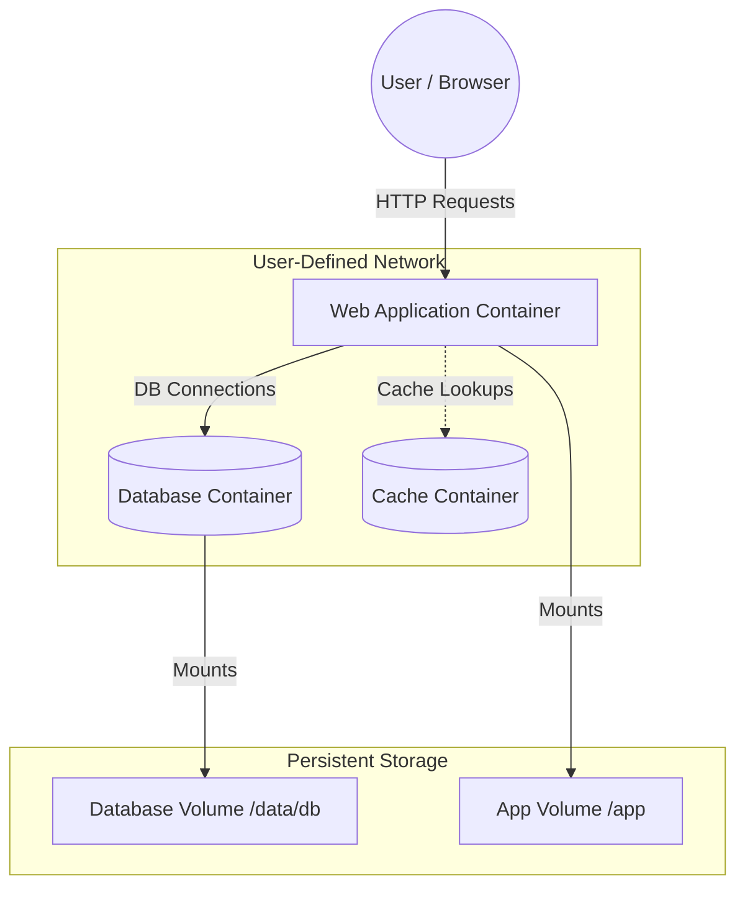
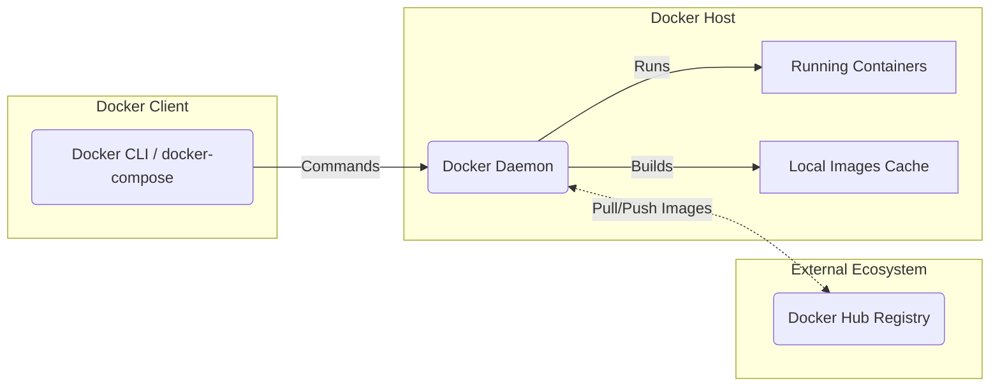

# Lab- 2A: Docker and Docker Compose Execution Report

**Student Name:** Swaraj Panmand  
**UCID:** 2023800075  
**Branch:** CSE ENT1  

## Overview
This repository records the executed project and findings for **Lab- 2A: Laboratory on Docker and Docker Compose**. The primary objective of this laboratory was to containerize applications, manage multi-container setups using Docker Compose, and correctly implement Docker features such as networking, volumes, and environment variables.

## System Prerequisites
- Ubuntu Linux (or equivalent Docker-host OS)
- Docker Engine installed
- Docker Compose installed
- Internet Connectivity

## Final Architecture

The finalized project implements a multi-container architecture using Docker Compose. The environment consists of connected application services (e.g., a Web Frontend/API, Database) running inside an isolated user-defined Docker bridge network, backed by persistent data volumes.

## Executed Step-by-Step Instructions

The laboratory steps were thoroughly executed as outlined below:

### Part 1: Introduction to Docker
- Differentiated between traditional VMs and containerized environments.
- Installed Docker services and verified components using `docker --version`.
- Rehearsed container lifecycle commands (`docker pull`, `docker run`, `docker ps`, `docker stop`, `docker rm`).

### Part 2: Working with Docker Images and Containers
- Developed a `Dockerfile` implementing fundamental instructions (`FROM`, `WORKDIR`, `COPY`, `RUN`, `CMD`).
- Successfully built a custom Docker image from the localized code: `docker build -t my-app .`
- Deployed a container mapped to the host's port leveraging `-p 4000:80`.
- Managed persistent data manually through `docker volume create` and attached it via the `-v` flag.

### Part 3: Networking and Linking Containers
- Established an internal user-defined bridge network (`docker network create my-network`).
- Attached multiple containers to the isolated network allowing automatic DNS resolution by container name.
- Fed critical backend parameters securely using environment variables (`DB_HOST`, `DB_PORT`).

### Part 4: Docker Compose Orchestration
- Authored a declarative `docker-compose.yml` to oversee the whole environment.
- Brought up the interconnected stack natively using `docker-compose up`.
- Scaled isolated instances laterally utilizing `docker-compose up --scale web=3`.

### Part 5: Advanced Docker Compose Features
- Extended the `docker-compose.yml` file to handle advanced routing and storage tasks:
  - **Networks:** Explicitly linking target services to secured logical networks.
  - **Volumes:** Binding named persistent volumes to the respective paths avoiding data loss on container teardown.
  - **Environment Variables:** Abstracting configurations to structured, secure `.env` files.

## Docker Internal Diagram

## Best Practices Adopted
- Crafted optimized Dockerfiles using reduced layout caches and un-cached package installations (e.g., `pip install --no-cache-dir`).
- Separated infrastructure definitions for dynamic scalability.
- Shielded delicate configuration parameters via `.env` file abstraction.
- Kept root privileges and user bindings minimal based on secure base images (e.g., `python:3.8-slim`).

## References
1. [Official Docker Instructions](https://docs.docker.com/get-started/overview/)
2. [Docker Compose Reference](https://docs.docker.com/compose/)
3. *Docker: Up & Running* by Matthias, K., & Kane, S.
